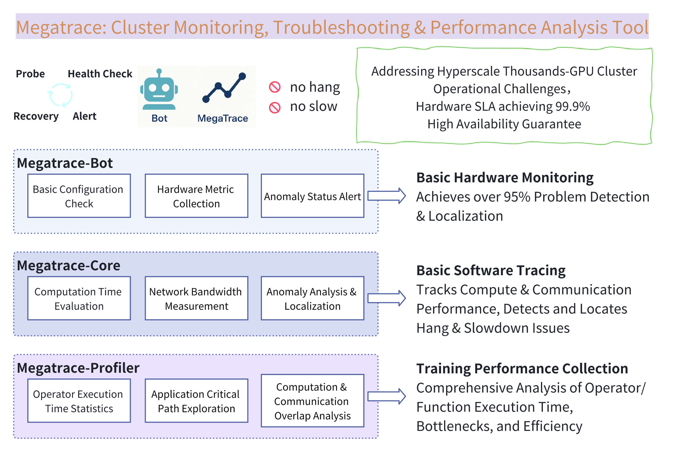

<br>
<br>
<h1 align="center">Megatrace</h1>

<p align="center">
  <a href="https://example.com/paper">📄 Paper</a> | 
  <a href="asset/wechat_qrcode.png"> WeChat Group</a> | 
  <a href="README_zh.md">🇨🇳 Chinese</a>
</p>

## 🅾 Introduction

Megatrace is a systematic framework for large model training inspection, monitoring, analysis, and fault localization. On the hardware side, it collects cluster status through end-side Agents, identifies key abnormal indicators, and is equipped with an alert bot system. On the software side, it implements business status perception by collecting data points in NCCL, a core component, and can identify hanging and slow nodes through analysis of the collected results.

## 🏛️ Overall Architecture

Megatrace adopts a layered architecture design, comprehensively covering monitoring and analysis needs from underlying hardware to application layers:

### Basic Hardware Monitoring
Achieves over 95% problem detection and localization through comprehensive monitoring of cluster infrastructure, timely detecting and locating hardware-level anomalies.

### Basic Software Tracing
Traces computing and communication performance, discovers and locates hanging and slowdown issues, with in-depth tracing of core communication libraries such as NCCL.

### Training Performance Collection
Comprehensively analyzes operator function execution time, identifies key bottlenecks and efficiency issues, and provides data support for training optimization.

## 📬 Key Features

### 1) Bot - Infrastructure Monitoring and Alert Platform
A comprehensive monitoring and alert system built on Kubernetes and Prometheus, designed for large-scale containerized environments, capable of monitoring various resources and service status from infrastructure to application level.

#### Core Architecture
- **Monitoring Data Collection Layer**: Collects comprehensive performance metrics through various Exporters
- **Alert Management Layer**: Multi-dimensional monitoring thresholds and conditions defined based on Prometheus Rule language
- **Notification Distribution Layer**: Supports multiple notification channels including Feishu groups, spreadsheets, and phone calls

#### Comprehensive Monitoring Scope
- **Kubernetes Core System Components**: apiserver, scheduler, controller-manager, etcd, kubelet, coredns
- **Physical Nodes and Infrastructure**: CPU, memory, disk, network, IB, RoCE
- **Storage and Middleware**: Ceph, RBD, S3, Postgres, Harbor
- **Network and Container Environment**: Calico Felix, Ingress Nginx
- **GPU Resource Monitoring**: Professional metrics provided through NVIDIA DCGM Exporter and domestic GPU Exporters
- **Scheduler and Application Components**: Volcano Scheduler, Kafka, Minio, etc.

#### Intelligent Alert System
- **Multi-level Alert Classification Mechanism**: P0 (most severe), P1 (important), P2 (general), P3 (notification)
- **Diversified Notification Channels**: Feishu group hierarchical notification, Feishu spreadsheet archiving, P0-level critical alert phone notification
- **Alert Statistics and Review**: Regularly generates weekly alert statistics reports, providing system operation status review and trend analysis
- **Intelligent Alert Processing**: Alert filtering, deduplication, and recurring alert processing to effectively avoid "alert storms"

### 2) Trace - Application Layer Data Collection
Performs in-depth tracing of communication performance during training, achieving precise perception of training status through data point collection in NCCL.

#### Core Functions
- **NCCL API Call Collection**: Collects time information of each communication call, reflecting the computation execution status of training
- **Ring Buffer**: Implements temporary storage of logs, optimizing storage resource usage
- **Overlay Log Collection**: Efficiently records key information, ensuring important data is not lost
- **Hang Detection**: Discovers computation hang issues by detecting nodes with missing communication calls
- **Slow Node Detection**: Identifies slow computation nodes by comparing the sequence of collective communication calls

### 3) Analysis - Fault Diagnosis and Analysis
Performs in-depth analysis of collected monitoring data and tracing information, providing intelligent fault diagnosis and performance optimization recommendations.

#### Main Analysis Capabilities
- **Hang Node Detection**: Analyzes logs generated after hangs, analyzes missing calls, and locates computation hang nodes
- **Slowdown Node Detection**: Analyzes logs output when slowdowns are detected, searching for slow computation nodes
- **3D Parallel Configuration Analysis**: Optimizes analysis for parallel strategies in large-scale model training
- **Performance Bottleneck Identification**: Identifies key bottlenecks in the training process through comparison and statistical analysis

## 🚀 Quick Start Guide

### 1. Clone the Repository and Enter the Project Directory
```bash
# Clone the Megatrace repository
git clone https://github.com/sii-research/Megatrace.git
cd Megatrace
```

### 2. Choose the Components You Need
- **Bot Component**: Infrastructure monitoring and alerts (suitable for cluster administrators)
- **Trace Component**: NCCL call tracing (suitable for training developers)
- **Analysis Component**: Log analysis tools (suitable for training debuggers)

Please refer to the detailed setup and usage instructions for the corresponding components below.

## ⚒️ Building from Source

> **Note**: Currently, only source builds are supported.

### 1. Building the Bot Component
The Bot component is used for infrastructure monitoring and alert notifications and needs to be deployed in a Kubernetes environment.

#### Prerequisites
- Installed and configured Kubernetes cluster
- Installed Helm package manager
- Cluster administrator privileges

#### Deployment Steps
```bash
# Execute in the root directory of the Megatrace project

# Enter the Bot directory
cd bot

# Run the installation script (automatically completes most configurations)
./install.sh

# Or deploy manually
## Install dependencies
helm repo add prometheus-community https://prometheus-community.github.io/helm-charts
helm repo update
## Deploy kube-prometheus-stack
helm install monitoring prometheus-community/kube-prometheus-stack -n monitoring --create-namespace -f values.yaml

# Configure alert notifications
## Enter the Feishu alert configuration directory
cd alert-to-feishu
## Modify the configuration file, set AlertManager address and Feishu webhook
vi config.py
## Start the alert distribution service
python3 alert_system_main.py
```

### 2. Building the Trace Component
The Trace component is used for NCCL call tracing and requires patching and recompiling the NCCL library.

#### Prerequisites
- Installed NVIDIA CUDA environment
- Installed Git and compilation tools
- Sufficient compilation resources (recommended at least 8-core CPU)

#### Deployment Steps
```bash
# Execute in the root directory of the Megatrace project

# Enter the Trace directory
cd trace

# Clone the NVIDIA NCCL repository
git clone https://github.com/NVIDIA/nccl.git
cd nccl

# Apply the Megatrace patch
git checkout v2.21.5-1
git apply ../megatrace_nccl.patch 

# Compile the NCCL library (taking Hopper architecture as an example)
# Adjust NVCC_GENCODE parameters according to your GPU architecture
make -j80 src.build NVCC_GENCODE="-gencode=arch=compute_90,code=sm_90"

# After compilation is complete, the NCCL library will be located in build/lib of the current directory
```

### 3. Building the Analysis Component
The Analysis component provides log analysis tools for diagnosing problems during training.

#### Prerequisites
- Python 3.7 or higher
- pip package manager

#### Deployment Steps
```bash
# Execute in the root directory of the Megatrace project

# Enter the Analysis directory
cd trace/analysis

# Install Python dependencies
python -m pip install -r requirements.txt
# Note: requirements.txt lists basic dependencies by default; you can uncomment optional lines to install additional dependencies
```

## 🍽️ Usage Guide

### Using Trace Functionality

Trace functionality needs to be enabled in the training script, controlled by setting environment variables.

#### Usage Steps
1. Ensure the NCCL library with the Megatrace patch has been successfully compiled
2. Add the following environment variables before the training command:

```bash
# Add environment variables directly before the training command
-x NCCL_MEGATRACE_SENSTIME=300    # Sensitivity level (seconds)
-x NCCL_MEGATRACE_ENABLE=1        # Enable switch (1=on, 0=off)
-x NCCL_MEGATRACE_LOG_PATH=/path/to/save/logs   # Log save path
-x LD_LIBRARY_PATH=/path/to/nccl/build/lib:$LD_LIBRARY_PATH   # Path to the patched NCCL library

# Complete example (using PyTorch training as an example)
NCCL_MEGATRACE_SENSTIME=300 NCCL_MEGATRACE_ENABLE=1 NCCL_MEGATRACE_LOG_PATH=/tmp/megatrace_logs LD_LIBRARY_PATH=/path/to/nccl/build/lib:$LD_LIBRARY_PATH python train.py
```

### Using Analysis Functionality

The Analysis component provides multiple analysis tools for parsing log files generated by Trace. All analysis commands need to be executed in the analysis directory.

#### Configuration File Setup
First, create or modify the config.yaml file in the analysis directory:
```yaml
# In the trace/analysis/config.yaml file
TP: 2       # Tensor parallelism
PP: 4       # Pipeline parallelism
world_size: 8  # Total number of processes
# DP will be automatically calculated as world_size // (TP*PP)
```

#### Unified Command-Line Interface (Recommended)
Run the following commands in the trace/analysis directory:
```bash
# Execute in the trace/analysis/ directory

# Perform all analyses
python test_analyzer.py --log-path logs --test-type all --verbose

# Only perform hang detection
python test_analyzer.py --log-path logs --test-type hang

# Perform slow node analysis (includes parallel-aware detection when configuration is provided)
python test_analyzer.py --log-path logs --test-type slow --config-path config.yaml

# Perform 3D parallel configuration analysis
python test_analyzer.py --log-path logs --test-type parallel --config-path config.yaml
```

#### Using Standalone Tools
- Parallel slow node detector (for development/benchmarking):
```bash
# Execute in the trace/analysis/ directory
python parallel_slow_detector.py --logs-path logs --config-path config.yaml --verbose
```

## 🔍 Testing Tools

### GPU Interference Testing Tool
The GPU interference testing tool is used to simulate GPU performance degradation and test Megatrace's ability to detect slow nodes.

#### Usage Method
```bash
# Execute in the trace/analysis/simulator/ directory

# Basic interference: on device 0, duration 120 seconds, 4 parallel streams, 8192 matrix size
python gpu_interferer.py --device 0 --duration 120 --workers 4 --matrix-size 8192

# Increase memory pressure by 6GB, use float16, 10ms interval per round
python gpu_interferer.py --device 0 --duration 120 --workers 4 --matrix-size 8192 --dtype float16 --mem-gb 6 --sleep-ms 10
```

## 🙇‍♂️ License and Acknowledgments

* Please see the LICENSE for detailed licensing terms.

* Thanks to the open-source community (including but not limited to NCCL and nccl-tests projects) for their excellent work.
