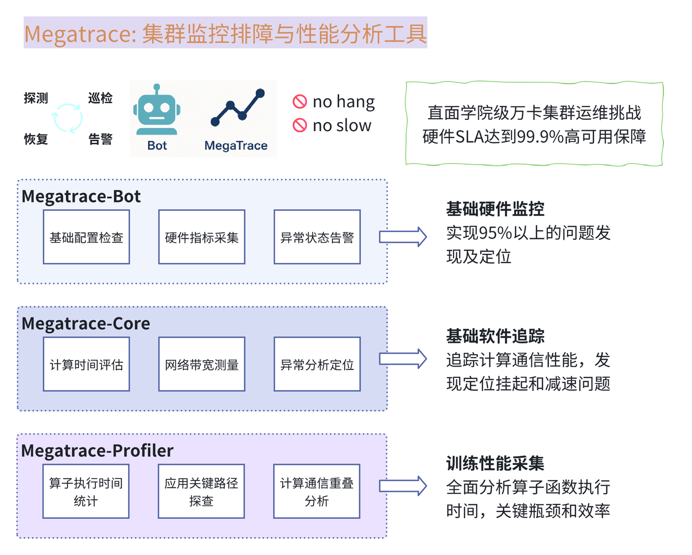

<br>
<br>
<h1 align="center">Megatrace</h1>

<p align="center">
  <a href="https://example.com/paper">📄 论文</a> |  
  <a href="asset/wechat_qrcode.png"> 微信交流群</a> | 
  <a href="README.md">🇺🇸 English</a>
</p>

## 🅾 简介

Megatrace是一套大模型训练检查、监控、分析和故障定位的系统性工作。底层硬件侧通过端侧的Agent监控收集集群状态，对关键的异常指标进行识别，同时配备告警机器人系统。软件层通过在核心组件--NCCL中进行打点收集，实现对业务进行状态的感知，通过对收集的结果进行分析可以得到hang和慢的节点位置。

## 🏛️ 整体架构

Megatrace采用分层架构设计，全面覆盖从底层硬件到应用层的监控与分析需求：

### 基础硬件监控
实现95%以上的问题发现即定位，通过对集群基础设施的全面监控，及时发现并定位硬件层面的异常。

### 基础软件追踪
追踪计算通信性能，发现定位挂起和减速问题，针对NCCL等核心通信库进行深度追踪。

### 训练性能采集
全面分析算子函数执行时间，识别关键瓶颈和效率问题，为训练优化提供数据支持。

## 📬 关键特性

### 1) Bot - 基础设施监控告警平台
基于Kubernetes和Prometheus构建的全方位监控告警系统，专为大规模容器化环境设计，能够监控从基础设施到应用级别的各类资源和服务状态。

#### 核心架构
- **监控数据采集层**：通过多种Exporter收集全面的性能指标
- **告警管理层**：基于Prometheus Rule语言定义的多维度监控阈值和条件
- **通知分发层**：支持飞书群组、表格、电话等多种通知渠道

#### 全面监控范围
- **Kubernetes核心系统组件**：apiserver、scheduler、etcd等
- **物理节点与基础设施**：CPU、内存、磁盘、网络、IB、RoCE等
- **存储与中间件**：Ceph、S3、Postgres、Harbor等
- **网络和容器环境**：Calico Felix、Ingress Nginx等
- **GPU资源监控**：通过NVIDIA DCGM Exporter和国产GPU Exporter提供专业指标
- **调度器与应用组件**：Volcano Scheduler、Kafka、Minio等

#### 智能告警系统
- **多级告警分级机制**：P0（最严重）、P1（重要）、P2（一般）、P3（提示）
- **多样化通知渠道**：飞书群组分级通知、飞书表格归档、P0级关键告警电话通知
- **告警统计与回顾**：定期生成告警统计周报，提供系统运行状态回顾与趋势分析
- **智能告警处理**：告警过滤、去重和复发告警处理，有效避免"告警风暴"

### 2) Trace - 应用层数据打点收集
针对训练过程中的通信性能进行深度追踪，通过在NCCL中进行数据打点收集，实现对训练状态的精准感知。

#### 核心功能
- **NCCL API调用收集**：采集每个通信调用的时间信息，反映训练的计算执行情况
- **环形缓冲区(RingBuffer)**：实现对log的暂存，优化存储资源使用
- **覆盖式日志采集**：高效记录关键信息，确保重要数据不丢失
- **Hang检测**：通过检测通信调用缺失的节点，发现计算hang的问题
- **慢节点检测**：通过对比集合通信调用的先后顺序，发现计算慢的节点

### 3) Analysis - 故障诊断与分析

对收集到的监控数据和追踪信息进行深度分析，提供智能化的故障诊断和性能优化建议。

#### 主要分析能力
- **hang节点检测**：分析hang之后产生的log，对调用缺失进行分析，找到计算hang节点
- **slowdown节点检测**：分析检测到慢时输出的log，寻找调用慢的计算节点
- **3D并行配置分析**：针对大规模模型训练的并行策略进行优化分析
- **性能瓶颈识别**：通过对比和统计分析，识别训练过程中的关键瓶颈

## 🚀 快速入门指南

### 1. 克隆仓库并进入项目目录
```bash
# 克隆Megatrace仓库
git clone https://github.com/sii-research/Megatrace.git
cd Megatrace
```

### 2. 选择需要使用的组件
- **Bot组件**：基础设施监控告警（适合集群管理员）
- **Trace组件**：NCCL调用追踪（适合训练开发者）
- **Analysis组件**：日志分析工具（适合训练调试人员）

请参考下方对应组件的详细搭建和使用说明。

## ⚒️ 从源码搭建

> **Note**: Currently, only source builds are supported.

### 1. Bot组件搭建
Bot组件用于基础设施监控和告警通知，需要在Kubernetes环境中部署。

#### 前提条件
- 已安装并配置好Kubernetes集群
- 已安装Helm包管理器
- 具备集群管理员权限

#### 部署步骤
```bash
# 在Megatrace项目根目录下执行

# 进入Bot目录
cd bot

# 运行安装脚本（自动完成大部分配置）
./install.sh

# 或手动部署
## 安装依赖
helm repo add prometheus-community https://prometheus-community.github.io/helm-charts
helm repo update
## 部署 kube-prometheus-stack
helm install monitoring prometheus-community/kube-prometheus-stack -n monitoring --create-namespace -f values.yaml

# 配置告警通知
## 进入飞书告警配置目录
cd alert-to-feishu
## 修改配置文件，设置AlertManager地址和飞书webhook
vi config.py
## 启动告警分发服务
python3 alert_system_main.py
```

### 2. Trace组件搭建
Trace组件用于NCCL调用追踪，需要对NCCL库进行打补丁和重新编译。

#### 前提条件
- 已安装NVIDIA CUDA环境
- 已安装Git和编译工具
- 具备足够的编译资源（建议至少8核CPU）

#### 部署步骤
```bash
# 在Megatrace项目根目录下执行

# 进入Trace目录
cd trace

# 克隆NVIDIA NCCL仓库
git clone https://github.com/NVIDIA/nccl.git
cd nccl

# 应用Megatrace补丁
git checkout v2.21.5-1
git apply ../megatrace_nccl.patch 

# 编译NCCL库（以Hopper架构为例）
# 根据您的GPU架构调整NVCC_GENCODE参数
make -j80 src.build NVCC_GENCODE="-gencode=arch=compute_90,code=sm_90"

# 编译完成后，NCCL库将位于当前目录的build/lib下
```

### 3. Analysis组件搭建
Analysis组件提供日志分析工具，用于诊断训练过程中的问题。

#### 前提条件
- Python 3.7或更高版本
- pip包管理器

#### 部署步骤
```bash
# 在Megatrace项目根目录下执行

# 进入Analysis目录
cd trace/analysis

# 安装Python依赖
python -m pip install -r requirements.txt
# 注意：requirements.txt默认列出基础依赖，可取消注释可选行安装额外依赖
```

## 🍽️ 使用指南

### Trace功能使用

Trace功能需要在训练脚本中启用，通过设置环境变量来控制。

#### 使用步骤
1. 确保已经成功编译了带Megatrace补丁的NCCL库
2. 在训练命令前添加以下环境变量：

```bash
# 直接在训练命令前添加环境变量
-x NCCL_MEGATRACE_SENSTIME=300    # 敏感程度（秒）
-x NCCL_MEGATRACE_ENABLE=1        # 使能开关（1=开启，0=关闭）
-x NCCL_MEGATRACE_LOG_PATH=/path/to/save/logs   # 日志保存路径
-x LD_LIBRARY_PATH=/path/to/nccl/build/lib:$LD_LIBRARY_PATH   # 应用patch之后的NCCL库路径

# 完整示例（以PyTorch训练为例）
NCCL_MEGATRACE_SENSTIME=300 NCCL_MEGATRACE_ENABLE=1 NCCL_MEGATRACE_LOG_PATH=/tmp/megatrace_logs LD_LIBRARY_PATH=/path/to/nccl/build/lib:$LD_LIBRARY_PATH python train.py
```

### Analysis功能使用

Analysis组件提供多种分析工具，用于解析Trace生成的日志文件。所有分析命令都需要在analysis目录下执行。

#### 配置文件设置
首先，在analysis目录下创建或修改config.yaml文件：
```yaml
# 在 trace/analysis/config.yaml 文件中
TP: 2       # 张量并行度
PP: 4       # 流水线并行度
world_size: 8  # 总进程数
# DP会自动计算为 world_size // (TP*PP)
```

#### 统一命令行接口（推荐）
在trace/analysis目录下运行以下命令：
```bash
# 在 trace/analysis/ 目录下执行

# 执行所有分析
python test_analyzer.py --log-path logs --test-type all --verbose

# 仅执行hang检测
python test_analyzer.py --log-path logs --test-type hang

# 执行慢节点分析（当提供配置时包含并行感知检测）
python test_analyzer.py --log-path logs --test-type slow --config-path config.yaml

# 执行3D并行配置分析
python test_analyzer.py --log-path logs --test-type parallel --config-path config.yaml
```

#### 独立工具使用
- 并行慢节点检测器（用于开发/基准测试）：
```bash
# 在 trace/analysis/ 目录下执行
python parallel_slow_detector.py --logs-path logs --config-path config.yaml --verbose
```

## 🔍 测试工具

### GPU干扰测试工具
GPU干扰测试工具用于模拟GPU性能下降的情况，测试Megatrace系统的慢节点检测能力。

#### 使用方法
```bash
# 在 trace/analysis/simulator/ 目录下执行

# 基础干扰：在0号卡上，持续120秒，4个并行流，8192矩阵规模
python gpu_interferer.py --device 0 --duration 120 --workers 4 --matrix-size 8192

# 增加显存压力6GB、使用float16、每轮间隔10ms
python gpu_interferer.py --device 0 --duration 120 --workers 4 --matrix-size 8192 --dtype float16 --mem-gb 6 --sleep-ms 10
```

## 🙇‍♂️ 许可证与致谢

* 详细许可条款请见 LICENSE。

* 感谢开源社区（包括但不限于 NCCL 与 nccl-tests 项目）的卓越工作。
